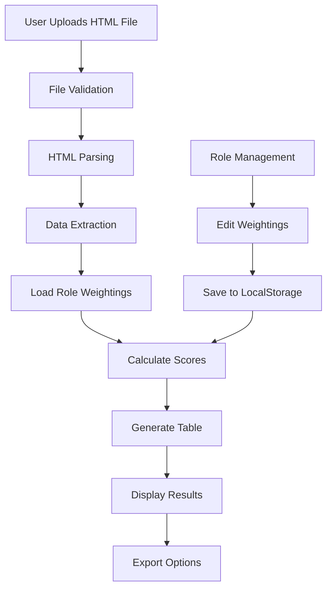

# FM Client App - Comprehensive Analysis Report

## Executive Summary

The FM Client App is a web-based Football Manager Player Scoring System that analyzes and scores players based on custom role weightings. Originally created by HarrisonRClark, this application helps Football Manager game enthusiasts evaluate player compatibility with different tactical roles through sophisticated attribute weighting calculations.

**Repository:** https://github.com/HarrisonRClark/fm_client_app  
**Live Demo:** https://fm-client-app.vercel.app  
**Technology:** Vanilla JavaScript, HTML5, CSS3, Bootstrap 5.3.2  
**Architecture:** Pure client-side application with no backend dependencies

## Core Purpose & Functionality

### Primary Features
1. **HTML File Processing**: Imports player data from HTML files exported from Football Manager
2. **Player Scoring Algorithm**: Calculates compatibility scores for 60+ tactical roles
3. **Interactive Data Table**: Sortable, filterable, and exportable player data
4. **Role Management**: Customizable attribute weightings for each tactical role
5. **Export Capabilities**: JSON, XML, CSV, Excel, and PDF export formats

### Target Users
- Football Manager game players
- Tactical analysts for the game
- Players seeking to optimize team composition
- Scout report analyzers

## Technical Architecture

### Technology Stack

#### Frontend Technologies
- **HTML5**: Core structure with Bootstrap components
- **JavaScript (ES6+)**: Modular architecture with 8 specialized modules
- **CSS3**: Minimal custom styling (255 bytes)
- **Bootstrap 5.3.2**: UI framework for responsive design
- **jQuery**: DOM manipulation and event handling
- **Bootstrap Table**: Advanced data table functionality

#### Data Storage
- **Browser LocalStorage**: Persistent storage for user preferences and role modifications
- **No Database**: All processing happens client-side
- **No Server Requirements**: Static file hosting only

### Project Structure

```
fm_client_app/
├── index.html           (10,122 bytes) - Main application entry point
├── README.md            (1,184 bytes)  - Project documentation
├── assets/
│   └── data/
│       └── roles.json   (61,007 bytes) - Role definitions and weightings
├── css/
│   └── main.css         (255 bytes)    - Custom styles
└── js/
    ├── dataProcessing.js    (4,329 bytes) - Core scoring calculations
    ├── processFile.js       (4,928 bytes) - HTML file parsing
    ├── listFilter.js        (4,958 bytes) - Role selection interface
    ├── tableGeneration.js   (2,698 bytes) - Table initialization
    ├── editWeighting.js     (3,051 bytes) - Role customization
    ├── fileUpload.js        (2,270 bytes) - File upload handling
    ├── toastNotifications.js (901 bytes)  - Notification system
    └── themeToggle.js       (305 bytes)   - Theme switching
```

## Detailed Feature Analysis

### 1. File Processing System

#### Input Requirements
- **Format**: HTML files containing player data tables
- **Structure**: Tables with columns like 'Nationality', 'Pac', 'Acc', etc.
- **Size Limit**: Maximum 20,000 rows per file
- **Validation**: File type, size, and structure checks

#### Processing Pipeline
1. File selection through HTML5 file input
2. File validation (type, size, structure)
3. HTML parsing and table extraction
4. Data transformation to JavaScript objects
5. Attribute range processing (e.g., "5-7" → average: 6)

### 2. Player Scoring Algorithm

#### Calculation Methodology
- **Base Attributes**: 36 different skill attributes per player
- **Weighting System**: 0-5 scale for each attribute per role
- **Derived Metrics**:
  - Speed: Average of Pace and Acceleration
  - Workrate: Average of Work Rate and Stamina
  - Set Pieces: Combination of corner, free kick, penalty taking, and throw-ins

#### Role Categories
- **Forwards**: Striker variations, wingers, attacking midfielders
- **Midfielders**: Central, defensive, box-to-box variations
- **Defenders**: Centre backs, full backs, wing backs
- **Goalkeepers**: Various goalkeeper roles

### 3. Role Management System

#### Available Roles (60+ total)
The system includes comprehensive Football Manager tactical roles such as:
- Advanced Forward, Complete Forward, Deep Lying Forward
- Box to Box Midfielder, Deep Lying Playmaker, Mezzala
- Ball Playing Defender, Complete Wing Back, Inverted Wing Back
- Sweeper Keeper, Traditional Goalkeeper

#### Customization Features
- Edit attribute weightings for any role
- Save modifications to localStorage
- Reset to default weightings
- Persistent across sessions

### 4. Data Table Features

#### Table Capabilities
- **Dynamic Columns**: Player attributes + selected role scores
- **Sorting**: All columns sortable
- **Export Formats**:
  - JSON (structured data)
  - XML (hierarchical format)
  - CSV (spreadsheet compatible)
  - Excel (direct .xlsx export)
  - PDF (formatted document)

#### Performance Features
- Efficient rendering with Bootstrap Table
- Pagination support for large datasets
- Responsive design for mobile devices

### 5. User Interface Components

#### Main Interface Elements
1. **File Upload Section**: Drag-and-drop or click to upload
2. **Role Selector**: Searchable list with pills for selected roles
3. **Data Table**: Main results display
4. **Export Controls**: Format selection and download
5. **Theme Toggle**: Dark/light mode switch

#### User Experience Features
- Toast notifications for feedback
- Loading spinners during processing
- Performance timer display
- Responsive Bootstrap layout
- Keyboard navigation support

## Data Flow Architecture



## Implementation Details

### JavaScript Module Breakdown

#### dataProcessing.js
- **Purpose**: Core calculation engine
- **Key Functions**:
  - `calculatePlayerScores()`: Main scoring algorithm
  - `loadRoleData()`: Async role data loading
  - `processAttributeRanges()`: Handle range values
  - `computeDerivedMetrics()`: Calculate Speed, Workrate, Set Pieces

#### processFile.js
- **Purpose**: HTML file handling and parsing
- **Key Functions**:
  - `parseHTMLFile()`: Extract table data from HTML
  - `validateTableStructure()`: Ensure required columns exist
  - `transformToPlayerObjects()`: Convert table rows to objects
  - `handleParsingErrors()`: Error recovery and reporting

#### listFilter.js
- **Purpose**: Role selection and filtering interface
- **Key Functions**:
  - `initializeRoleList()`: Populate available roles
  - `filterRoles()`: Real-time search filtering
  - `handleRoleSelection()`: Add/remove role selections
  - `updateSelectedRolesDisplay()`: Visual pill management

#### tableGeneration.js
- **Purpose**: Bootstrap table configuration
- **Key Functions**:
  - `initializeTable()`: Bootstrap Table setup
  - `configureColumns()`: Dynamic column generation
  - `setupExportOptions()`: Export format handlers
  - `applyResponsiveSettings()`: Mobile optimization

#### editWeighting.js
- **Purpose**: Role customization interface
- **Key Functions**:
  - `openEditModal()`: Launch edit interface
  - `saveWeightingChanges()`: Persist to localStorage
  - `resetToDefaults()`: Restore original weightings
  - `validateWeightingInputs()`: Input validation

## Tauri Migration Considerations

### Advantages of Tauri Conversion

1. **Native File System Access**: Direct file operations without browser limitations
2. **Better Performance**: Native execution with smaller memory footprint
3. **System Integration**: System tray, notifications, keyboard shortcuts
4. **Security**: No browser vulnerabilities, sandboxed execution
5. **Distribution**: Single executable, auto-updates, app stores

### Migration Strategy

#### Phase 1: Basic Wrapper
1. Create Tauri project structure
2. Move existing web assets to Tauri frontend
3. Configure window settings and menus
4. Test basic functionality

#### Phase 2: Native Enhancements
1. Replace HTML5 file input with native file dialogs
2. Implement native file system operations
3. Add system tray integration
4. Create keyboard shortcuts

#### Phase 3: Performance Optimization
1. Move heavy calculations to Rust backend
2. Implement multi-threading for large datasets
3. Add progress indicators for long operations
4. Optimize memory usage

#### Phase 4: Extended Features
1. Database integration for persistent storage
2. Advanced export options with native libraries
3. Auto-update functionality
4. Cross-platform testing and optimization

### Technical Requirements

#### Development Environment
- **Node.js**: v16+ for build tools
- **Rust**: Latest stable for Tauri backend
- **Tauri CLI**: For project management
- **Platform SDKs**: Windows, macOS, Linux as needed

#### Configuration Files Needed
- `tauri.conf.json`: Main Tauri configuration
- `package.json`: Frontend dependencies
- `Cargo.toml`: Rust dependencies

## Current Limitations & Improvement Opportunities

### Current Limitations
1. **File Size**: 20,000 row limit may be restrictive
2. **File Format**: Only HTML input supported
3. **Offline Only**: No cloud sync or sharing
4. **Browser Storage**: Limited by localStorage quotas
5. **No Data Persistence**: Lost on browser data clear

### Improvement Opportunities
1. **Multiple File Formats**: Support CSV, JSON, XML input
2. **Batch Processing**: Handle multiple files simultaneously
3. **Cloud Sync**: Optional user accounts with data sync
4. **Advanced Filtering**: Complex query builders
5. **Visualization**: Charts and graphs for player comparisons
6. **Team Building**: Suggested lineups based on available players
7. **Historical Tracking**: Player development over time
8. **API Integration**: Direct Football Manager game integration

## Security Considerations

### Current Security Model
- **Client-side Only**: No sensitive data transmission
- **No Authentication**: No user accounts or passwords
- **Local Storage**: Data remains on user's device
- **Input Validation**: File type and structure checks

### Tauri Security Enhancements
- **CSP Headers**: Content Security Policy implementation
- **Sandboxing**: Process isolation
- **Secure IPC**: Protected frontend-backend communication
- **Code Signing**: Verified application distribution

## Performance Metrics

### Current Performance
- **File Processing**: ~1-2 seconds for 1000 players
- **Score Calculation**: ~100-200ms per 100 players
- **Table Rendering**: ~500ms for full dataset
- **Export Generation**: ~1-3 seconds depending on format

### Expected Tauri Improvements
- **File Processing**: 50% faster with native operations
- **Score Calculation**: 80% faster with Rust backend
- **Memory Usage**: 40% reduction
- **Startup Time**: 70% faster than browser load

## Deployment & Distribution

### Current Deployment
- **Platform**: Vercel (static hosting)
- **URL**: fm-client-app.vercel.app
- **Updates**: Git push triggers deployment
- **No Installation**: Browser-based access

### Tauri Deployment Options
1. **Direct Download**: GitHub releases with auto-update
2. **App Stores**: Microsoft Store, Mac App Store
3. **Package Managers**: Homebrew, Chocolatey, Snap
4. **Portable Version**: No installation required

## Conclusion

The FM Client App is a well-architected, feature-rich application that serves the Football Manager community effectively. Its modular JavaScript structure, comprehensive role system, and user-friendly interface make it an excellent candidate for Tauri conversion.

The migration to Tauri would provide significant benefits including:
- Enhanced performance through native execution
- Better file handling capabilities
- Improved user experience with system integration
- Broader distribution options
- Potential for advanced features using Rust backend

The existing clean separation of concerns and modular architecture will facilitate a smooth transition to Tauri while maintaining the current functionality and user experience.

## Recommended Next Steps

1. **Set up Tauri development environment**
2. **Create initial Tauri project with existing web assets**
3. **Test core functionality in Tauri wrapper**
4. **Gradually migrate features to native implementations**
5. **Add Tauri-specific enhancements**
6. **Implement comprehensive testing**
7. **Prepare for multi-platform distribution**

This report provides a solid foundation for understanding the FM Client App and planning its conversion to a Tauri desktop application.